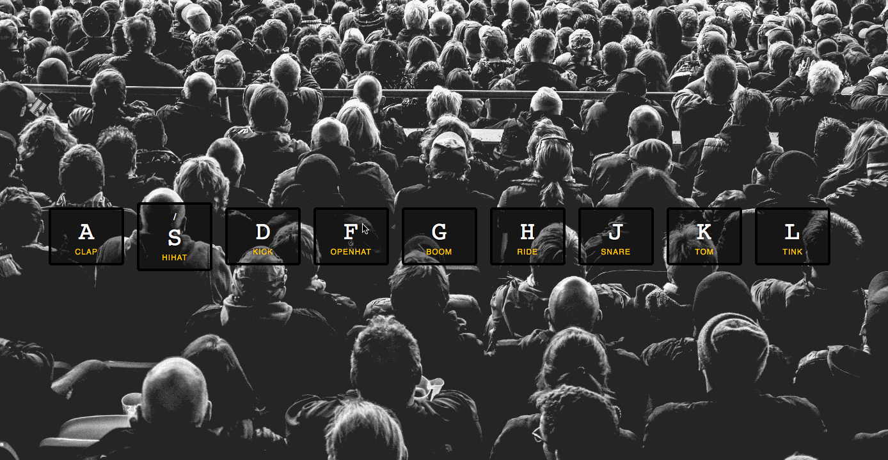

# Personal-Projects
A look inside my projects using HTML, CSS, and JAVASCRIPT.
This fun game uses the keys ASDFGHJKL, such that whenever any of these keys are pressed, they produce assigned drum sounds which can be used to make beats.

